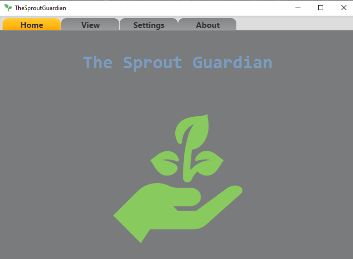
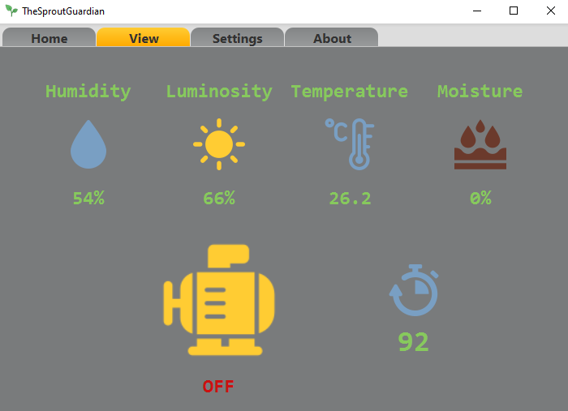

# The Sprout Guardian

## Where gardening meets technology ...

  

## A modern way to take care of your ornamental plant

  

  <h2>Two separate parts aligned for the same objective</h2>

  <h3> Wi-Fi Communication: </h3>
  - Receive data in JSON format over Wi-Fi.
   
  <h3> Sensor Information Updates: </h3>
  - Update information from sensors every 1000 ms.

  

The project above is designed to work as a desktop GUI that receives data from ESP32 via Wi-Fi. The code and a brief description of the hardware part can be found at the following link: [Code for ESP32](https://github.com/andrei-crisu/TheSproutGuardian-Embedded).
